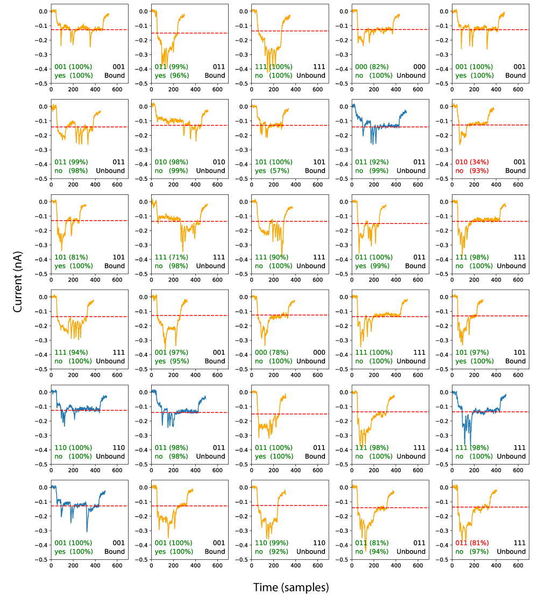
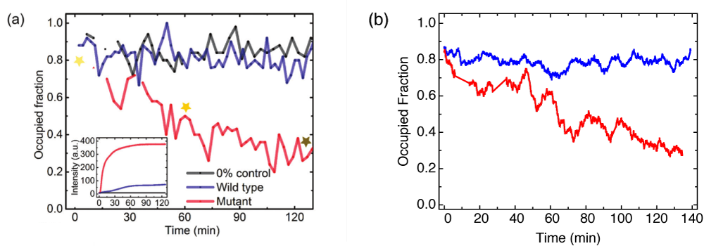
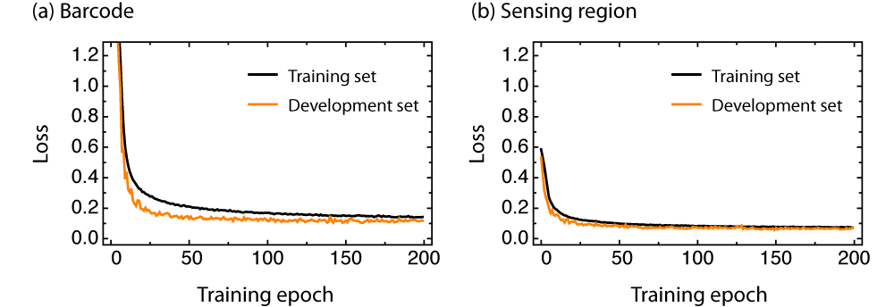

# QuipuNet: a convolutional neural network for single-molecule nanopore sensing

## Abstract

Nanopore sensing is a versatile technique for the analysis of molecules on the single-molecule level. However, extracting information from data with established algorithms usually requires time-consuming checks by an experienced researcher due to inherent variability of solid-state nanopores. Here, we develop a convolutional neural network (CNN) for the fully automated extraction of information from the time-series signals obtained by nanopore sensors. In our demonstration, we use a previously published dataset on multiplexed single-molecule protein sensing [1]. The neural network learns to classify translocation events with greater accuracy than previously possible, while also increasing the number of analysable events by a factor of five. Our results demonstrate that deep learning can achieve significant improvements in single molecule nanopore detection with potential applications in rapid diagnostics.

## Full article

Published: Nano Letters (todo) 

Preprint: https://arxiv.org/abs/1803.10653

Code repository: [github.com/kmisiunas/QuipuNet](https:github.com/kmisiunas/QuipuNet)

## Authors

 - **Karolis Misiunas** 
 - **Niklas Ermann**
 - **Ulrich F. Keyser** 

---

## Code

With the article we provide code, which you are free to use but please cite us. In addition we also provide the data nessesary to reproduce our results or to train train other (better) models. 
The following files are supplied

 - "QuipuNet_barcode_reader.ipynb" -- Jupyter notebook containing QuipuNet architecture, training, evaluation for barcode reading [1]
 - "QuipuNet_sensing_region.ipynb" -- Jupyter notebook containing QuipuNet for the sensing region where antibodies bind [1]
 - "QuipuNet_SNP_genotyping.ipynb" -- Jupyter notebook containing QuipuNet applied to another SNP binding nanopore readout [2]
 - "Data preparation.ipynb" -- Jupyter notebook for importing, cleaning and exporting nanopore data. 
 - "Human labelling.ipynb" -- Jupyter notebook with tools to assit manual trace labeling. 
 - "NBell evaluation.ipynb" -- Jupyter notebook for evaluating the original barcode indentification algorithm in [1]
 - "images/" -- directory containing figures for the supplementary materal
 - "Quipu/" -- additional python code for QuipuNet project
 - "models/" -- trained models to evaluate our code and try it on your data
 - "data/" -- data nessesary to train the models 

All Jupyter notebooks can be rentered on GitHub or via [nbviewer.jupyter.org](https://nbviewer.jupyter.org/) or localy using Jupyter program.

### Requrements 

You can run the our code yourself! For this you will need the following software (all can be obtained from [Anaconda project](https://www.anaconda.com/download/)):

 - python 3.6+
 - keras  
 - tensorflow 
 - jupyter with ipython 

---

## Supplementary material 

### Additional event examples

Figure S1 shows a larger random selection of events with QuipuNet interpretation of them.

**Figure S1**: 
Example events from the test set chosen randomly. The right bottom inset shows the true barcode and the true bound state for the sensing region. The left bottom inset is QuipuNet's prediction for the barcode and sensing region (yes for a bound protein). Green numbers are for correct predictions and red ones for incorrect predictions. In the brackets, the percentage indicates the confidence estimate for the predictions. The blue traces were labelled in [1]. 

### Error matrix for the best 80% 

In the paper, the error matrix in Figure 4c can be improved by discarding low confidence events. Figure S2 shows the error matrix for data utilised set to 80% (20% discarded data). This significantly improves the accuracy of all barcode predictions. The highest error is still for the '100' barcode, but the accuracy has increased from 0.86 to 0.90. Other barcodes have very high accuracy, with the second lowest being 001 with an accuracy of 0.97.

**Figure S2**: 
Error matrix: rows represent true barcodes from the test set, while columns are the barcodes that QuipuNet assigned them to. In an ideal case, it would be a diagonal matrix. The matrix was evaluated using the best 80% of the data.

### SNP dataset \[2\]

We demonstrate that QuipuNet can analyse other nanopore data by applying it to a different nanopore experiment. This time we look at single-nucleotide polymorphism (SNP) measurements using nanopores \[2\]. Here, the sensing region measures SNP state and there is no barcoding region. The sensing region is positioned in the middle of the DNA carrier structure. This experiments differ from \[1\] in three ways:

 - There is less training data. We have 14718 events in total, out of which 5458 events are unfolded, ie with no hairpin in the DNA molecule. The resulting training set is 4 times smaller than the one presented in the main paper.
 - The large variance between experiments due to variable nanopore shape. SNP binding is weak so approximately 10\% of events in bound measurements have an error in the form of a missing peak.
 - All three factors make this dataset more difficult to analyse using QuipuNet. In the ideal case, the experiment would have more data and experiments would be performed in similar nanopores.

We tested the accuracy of the algorithm on a small test set derived from the same experiments as the training set, but not included in the training set. We achieved accuracy (precision) of 0.92. In addition, we tested on an independent experiment, where we manually labelled 100 events. Here, the QuipuNet only achieves an accuracy of 0.72 on all the data and 0.91 on unfolded events. These results suggest that QuipuNet can accurately classify events, but suffers 20% accuracy drop if the folded events are included. We attribute this drop in accuracy to a smaller training set and poorly labelled training data. We also note that original analysis reported in \[2\] has an accuracy of approximately 0.9 on the unfolded events, while folded events could not be automatically classified. These results suggest that QuipuNet can interpret the SNP genotyping data from nanopore sensing. The accuracy and amount of events recovered are similar to the previous algorithms but is likely to improve if more data is collected.

For a visual comparison, Figure S3 shows that QuipuNet can reproduce original results reported in \[2\]. Here, the experiment is time sensitive because we are measuring bound state over time. QuipuNet reproduces the original results. This demonstration shows that QuipuNet can be readily applied to other nanopore experiments.

**Figure S3**: 
Comparison of classic analysis with QuipuNet for SNP genotyping data. (a) Reprinted from \[2\]: DNA displacement kinetics inferred from nanopore measurements. The occupied fraction of each data point is obtained from groups of 50 events over time. The concentration of the DNA carrier was 2 nM while the target strand was chosen to be 20 nM. 4 nM streptavidin was added 5 minutes before the measurements. The total event number in the plot is 2220, 2910 and 2130 for control, wild-type and mutant sample, respectively. The inset shows DNA displacement kinetics using fluorescence-based measurements. All measurements were performed in aqueous solution containing 4M LiCl, 100mM NaCl, 10mM KCl, 10mM MgCl2 buffered with TE (pH 7.5). (b) QuipuNet analysis of the data shown in (a). Only unfolded events were analysed to optimise for accuracy. A moving average was applied to a window size of 6 minutes.

### Details for neural network training 

To improve model generalisation of data, we perform data augmentation during training. The input data is augmented in three ways: by adding Gaussian noise ($\sigma = 0.08$), by adjusting the level (multiplying by a random number from a normal distribution with $\mu = 1$, $\sigma = 0.08$), and transforming the duration of the event (re-sampling 30% of the events). This data augmentation reduces over-fitting during training leading to a higher accuracy on the test and development sets.

The network convolution layers have their padding set to same while convolution strides are set to 1.

Figure S4 shows typical loss function convergence during training. The black lines are evaluated on the test set and orange lines are evaluated on the development set. We did not observe any instabilities that would cause the loss function to increase.

**Figure S4**: 
(a) Loss function for barcode throughout training. 
(b) Loss function for sensing region throughout training.

---
## References

 1. Bell, N. A. W. & Keyser, U. F. Digitally encoded DNA nanostructures for multiplexed, single-molecule protein sensing with nanopores. *Nature Nanotechnology* **11**, 645–651 (2016).
 2. Kong, J., Zhu, J. & Keyser, U. F. Single molecule based SNP detection using designed DNA carriers and solid-state nanopores. *Chem. Commun.* **53**, 436–439 (2017)
